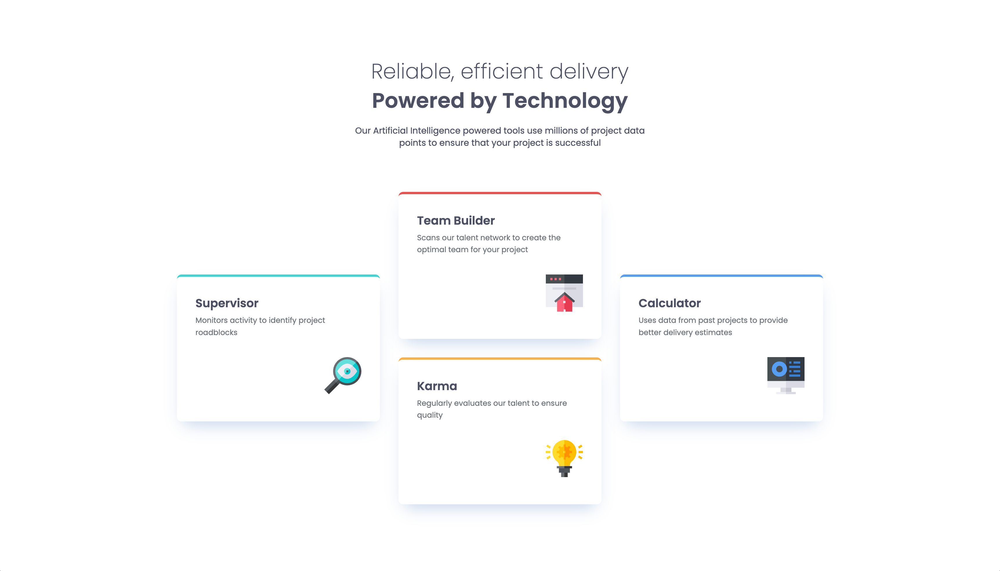

# Frontend Mentor - Four card feature section solution

This is my solution to the [Four card feature section](https://www.frontendmentor.io/challenges/four-card-feature-section-weK1eFYK) project.

## Screenshot

## Links

- [GitHub URL](https://github.com/ahong211/four-card-feature-section)
- [Live Site URL](https://ahong211.github.io/four-card-feature-section/)

## Built with

- Semantic HTML5
- CSS
- Grid, Flexbox
- Responsive elements

## Author

- Frontend Mentor - [@ahong211](https://www.frontendmentor.io/profile/ahong211)
